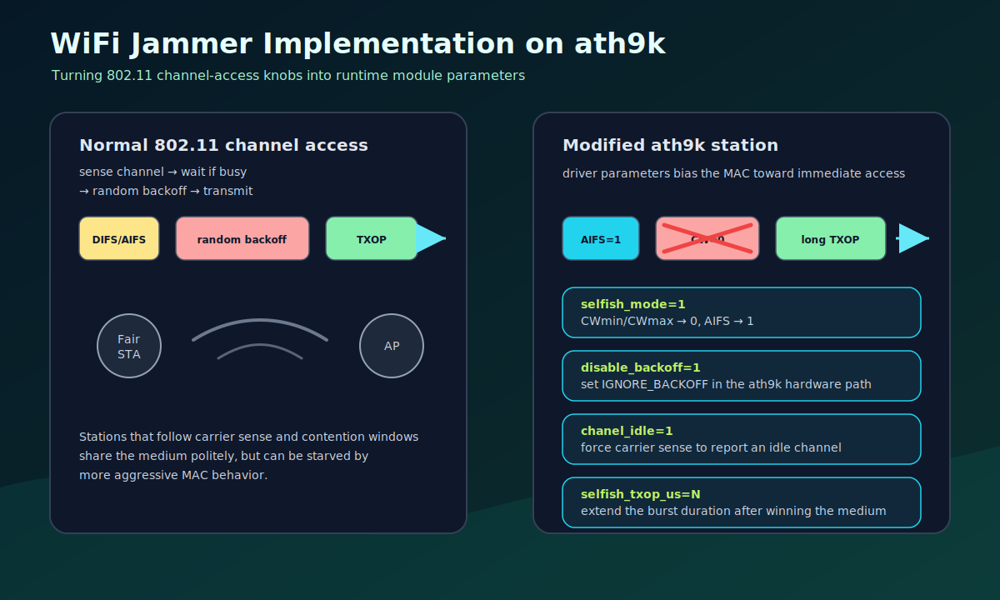
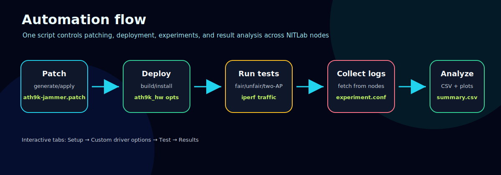
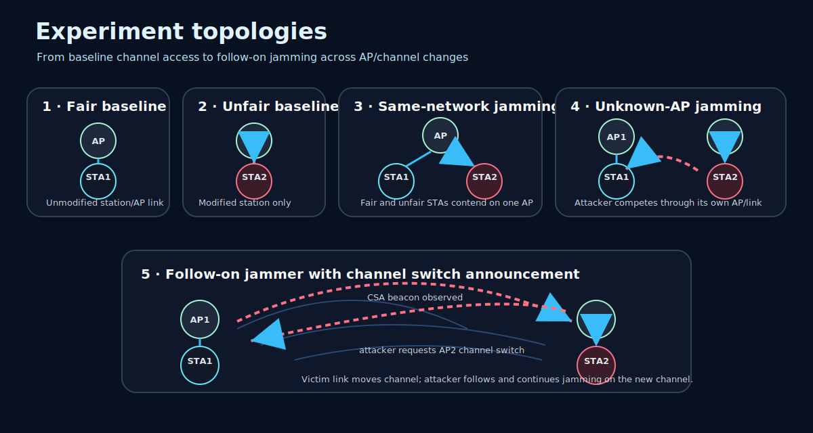
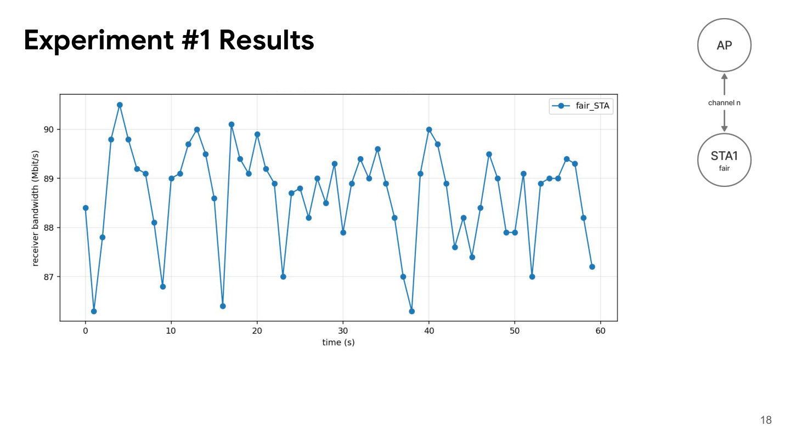
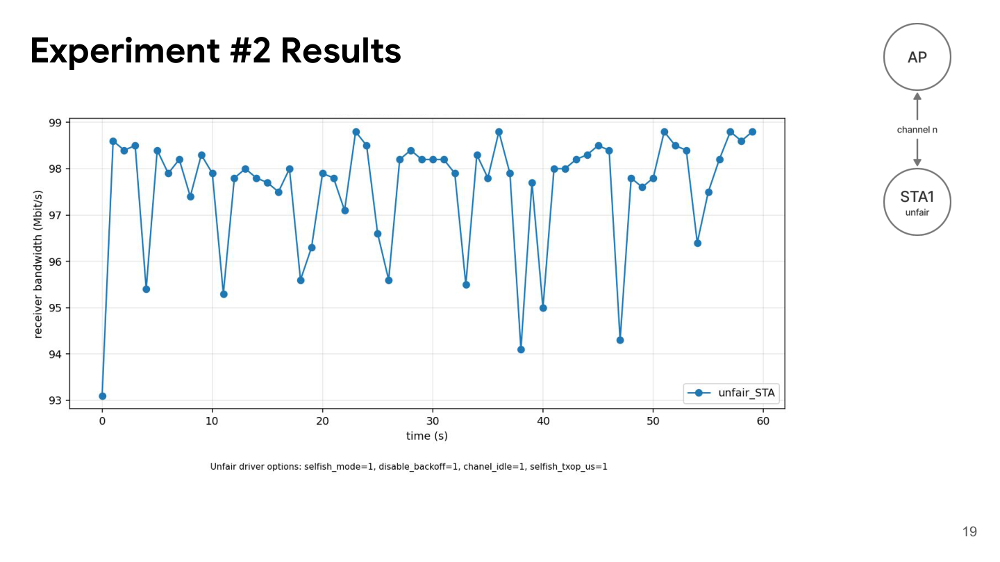
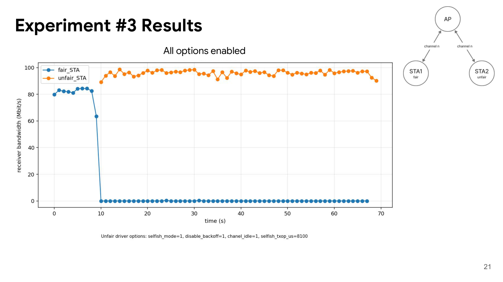
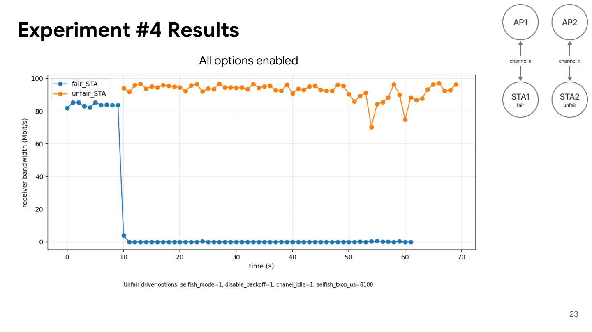

# WiFi Jammer Implementation on ath9k


Course project for **ECE436 — Wireless Communications** at the **University of Thessaly**, focused on medium-access unfairness in IEEE 802.11 networks. The project modifies the Linux backports **ath9k** driver so a station can be configured with aggressive MAC-layer behavior, then automates NITLab experiments that compare fair and unfair Wi-Fi stations under controlled topologies.

The implementation is intended for authorized lab experimentation only. It demonstrates how EDCA/CSMA-CA parameters and selected ath9k hardware registers affect channel access, throughput, and starvation behavior between competing wireless stations.

<p align="center">
  
</p>

## Highlights

- **ath9k driver patch:** adds module parameters for enabling/disabling unfair channel-access behavior without repeatedly editing driver source.
- **Contention-window/AIFS control:** `selfish_mode` forces `CWmin = 0`, `CWmax = 0`, and `AIFS = 1` before queue parameters are committed to hardware registers.
- **Backoff bypass:** `disable_backoff` keeps `AR_D_GBL_IFS_MISC_IGNORE_BACKOFF` set so the device bypasses the normal random-backoff procedure.
- **Forced idle channel:** `chanel_idle` intentionally uses the exported driver-parameter spelling and sets `AR_DIAG_FORCE_CH_IDLE_HIGH`, making the hardware behave as if the channel is idle.
- **TXOP override:** `selfish_txop_us` changes the transmit-opportunity/burst duration, capped by `AR_D_CHNTIME_DUR`.
- **Experiment automation:** a Bash workflow handles patch generation, NITLab image loading, remote driver deployment, AP/STA setup, iperf traffic generation, result collection, CSV parsing, and plot generation.

## Repository contents

| Path | Description |
| --- | --- |
| [`backports-5.4.56-1/`](backports-5.4.56-1/) | Linux backports 5.4.56-1 source tree with the ath9k changes applied. |
| [`patches/ath9k-jammer.patch`](patches/ath9k-jammer.patch) | Portable patch containing the ath9k changes against the backports source tree. |
| [`scripts/ece436-run.sh`](scripts/ece436-run.sh) | Main interactive/non-interactive experiment runner for NITLab deployment and result analysis. |
| [`run.sh`](run.sh) | Root-level compatibility wrapper that launches `scripts/ece436-run.sh`. |
| [`docs/wifi-jammer-ath9k-final-presentation.pdf`](docs/wifi-jammer-ath9k-final-presentation.pdf) | Final presentation describing the objective, implementation, experiment topologies, and results. |
| [`docs/images/`](docs/images/) | README diagrams and selected throughput plots from the final experiments. |

## Driver modifications

The project changes three ath9k source files:

| File | Role |
| --- | --- |
| `drivers/net/wireless/ath/ath9k/mac.c` | Declares runtime module parameters; applies `selfish_mode` queue changes; applies `selfish_txop_us` burst-time override; preserves custom idle/backoff bits during TX DMA abort. |
| `drivers/net/wireless/ath/ath9k/hw.c` | Sets the hardware bits for forced idle-channel behavior and backoff bypass during global hardware initialization. |
| `drivers/net/wireless/ath/ath9k/init.c` | Adds placeholder module parameters for additional jammer modes explored conceptually in the presentation. |

Main runtime parameters:

```text
selfish_mode=<0|1>       Set CWmin/CWmax to 0 and AIFS to 1 for aggressive queue access.
disable_backoff=<0|1>    Set AR_D_GBL_IFS_MISC_IGNORE_BACKOFF.
chanel_idle=<0|1>        Set AR_DIAG_FORCE_CH_IDLE_HIGH. The typo matches the exported parameter.
selfish_txop_us=<usec>   Override TXOP/burst duration in microseconds; 0 disables the override.
```

The final presentation also discusses broader jammer ideas such as deceptive, reactive, and follow-on behavior. In this repository, the implemented mechanisms are the configurable CSMA/CA, backoff, carrier-sense, and TXOP controls above.

## Experiment workflow

<p align="center">
  
</p>

The automation script supports both an interactive menu and direct commands.

```bash
./run.sh                 # interactive menu
./run.sh generate-patch  # regenerate patches/ath9k-jammer.patch from local source changes
./run.sh load-config experiment.conf
./run.sh export-config experiment.conf
./run.sh deploy-driver [nodes_csv] [patch_file]
./run.sh fetch-results [out_dir] [nodes_csv]
./run.sh parse-results experiment_dir [csv]
./run.sh plot-results experiment_dir [csv] [plot_dir]
./run.sh dry-run [out_dir]
./run.sh status [nodes_csv]
```

The interactive menu is organized into:

```text
1) Setup                 Configure NITLab gateway/slice/nodes, generate/apply the patch, load images.
2) Custom driver options Select fair/unfair ath9k module parameters.
3) Test                  Run fair-only, unfair-only, fair-vs-unfair, and two-AP experiments.
4) Results               Fetch logs, parse iperf output into CSV, and generate plots.
```

## Experiment topologies

<p align="center">
  
</p>

The final presentation describes five stages of testing:

1. **Fair station baseline:** one fair station connected to one AP, used to establish normal throughput behavior.
2. **Unfair station baseline:** one modified station connected to one AP, used to measure the practical limit of the modified driver alone.
3. **Single-link jammer test with known AP:** a fair STA/AP link is active while the unfair station joins the same network and competes aggressively.
4. **Single-link jammer test with unknown AP:** the unfair station interferes with a victim link without assuming the same AP knowledge.
5. **Follow-on/two-link scenario:** a victim AP/STA link and attacker AP/STA link operate together; the attacker follows a channel switch and continues jamming after CSA-driven channel movement.

## Building and installing the modified ath9k driver

The backports source comes from the official kernel.org backports stable archive:

```text
https://cdn.kernel.org/pub/linux/kernel/projects/backports/stable/v5.4.56/backports-5.4.56-1.tar.xz
```

Build and install the ath9k backports driver on the lab node:

```bash
cd backports-5.4.56-1
make defconfig-ath9k
make -j"$(nproc)"
sudo modprobe -r ath9k ath9k_common ath9k_hw ath mac80211 cfg80211 || true
sudo make install
sudo modprobe ath9k
modinfo ath9k_hw | grep -E 'selfish|backoff|chanel|txop'
```

Example unfair module options:

```bash
sudo modprobe -r ath9k ath9k_common ath9k_hw ath mac80211 cfg80211 || true
sudo modprobe ath9k_hw selfish_mode=1 disable_backoff=1 chanel_idle=1 selfish_txop_us=5000
sudo modprobe ath9k
```

The experiment runner performs these steps remotely for the configured NITLab nodes and records the requested/effective driver options in each experiment log directory.

## Results and plotting

`run.sh` collects node logs into experiment directories, parses iperf output, and creates CSV summaries plus plots. The script tracks experiment metadata separately from directory names so different runs can be compared without losing the exact driver configuration.

Typical local outputs:

```text
results/<collection>/<experiment>/experiment.conf
results/<collection>/<experiment>/summary.csv
plots/<experiment>/
```

The parser recognizes iperf2-style throughput lines and records metrics such as generated rate, measured bandwidth, jitter, packet loss, protocol, STA/AP role, node pair, and run timestamp.

Selected throughput plots from the final experiments:

<p align="center">
  
</p>

<p align="center">
  
</p>

<p align="center"><em>Baseline runs: a fair station stays near the high-80 Mbit/s range, while the modified station reaches a higher standalone throughput when all unfair options are enabled.</em></p>

<p align="center">
  
</p>

<p align="center">
  
</p>

<p align="center"><em>Jammer runs: with `selfish_mode=1`, `disable_backoff=1`, `chanel_idle=1`, and `selfish_txop_us=8100`, the modified station keeps almost all measured throughput while the fair station collapses to near-zero throughput after the unfair node starts transmitting.</em></p>
